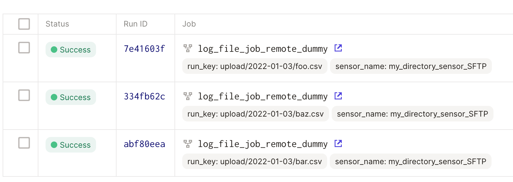

# SSH_DEMO

## usage

```bash
git clone https://github.com/geoHeil/dagster-ssh-demo.git
cd dagster-ssh-demo

conda activate base
conda install -y -c conda-forge mamba
conda deactivate

make create_environment

# follow the instructions below to set the DAGSTER_HOME
# and perform an editable installation (if you want to toy around with this dummy pipeline)
conda activate dagster-ssh-demo
pip install --editable .

dagit
# explore: Go to http://localhost:3000

# optionally enable:
dagster-daemon run
# to use schedules and backfills

docker-compose up
# to start the SFTP server
```

## problems

### case 1 naive python job (sftp_sensor_dummy.py):

Status: works
Result: remote file paths are logged



### case 2: naive python job with ssh-resoure (of dagster)

1. How to use the `dagster-ssh` resource?

### case 3: sensor + asset: how to transfer the configuration?

workaround: asset

