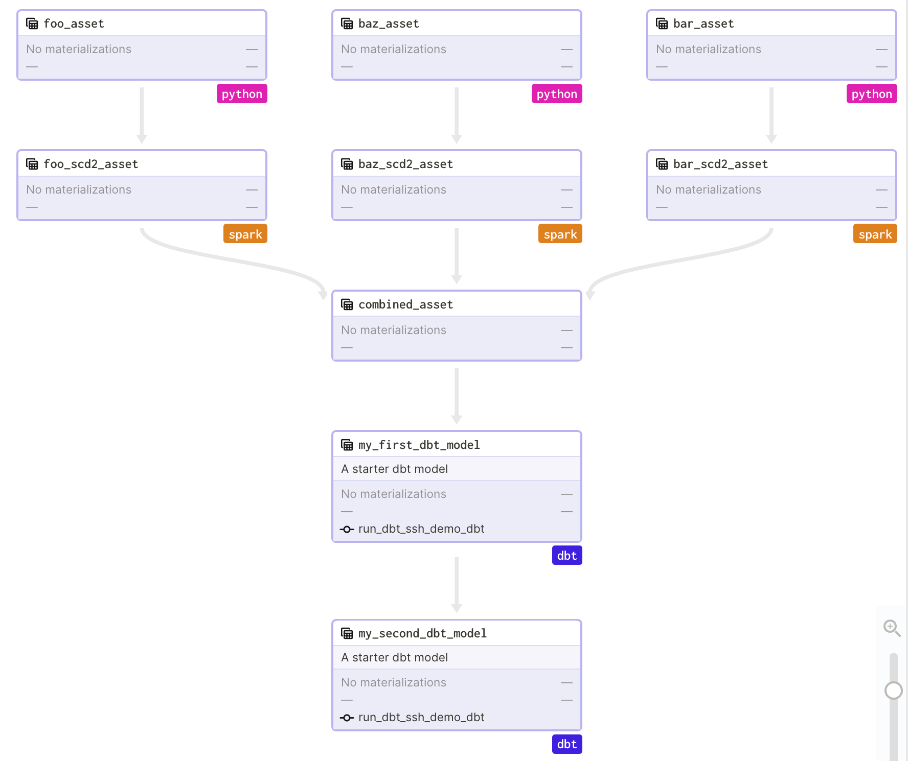

# SSH_DEMO

## usage

```bash
git clone https://github.com/geoHeil/dagster-ssh-demo.git
cd dagster-ssh-demo

conda activate base
conda install -y -c conda-forge mamba
conda deactivate

make create_environment

# follow the instructions below to set the DAGSTER_HOME
# and perform an editable installation (if you want to toy around with this dummy pipeline)
conda activate dagster-ssh-demo
pip install --editable .

dagit
# explore: Go to http://localhost:3000

# optionally enable:
dagster-daemon run
# to use schedules and backfills

docker-compose up
# to start the SFTP server
```

## questions

- partition aware downstream sensors https://dagster.slack.com/archives/C01U954MEER/p1649909251959589
  - is it needed at all?
  - can it be more direct i.e. passed down instead of listened?
  - can the listening be improved (pushed down)?
- optional resources / lazy instantiation https://dagster.slack.com/archives/C01U954MEER/p1650448663629669
  - same goes for DBT using duckDB


Further topics:
- general code review
- later docker-compose the example for deployment

open MRs/issues:
 - direct asset_key access https://github.com/dagster-io/dagster/pull/7395 (TODO fix workaround)
 - UI inconsistencies for Job an Asset graph view
  - compute_kind metadata missing https://github.com/dagster-io/dagster/issues/7503 and https://github.com/dagster-io/dagster/issues/6956
  - stale UI notification in asset https://github.com/dagster-io/dagster/issues/7434 why is this also a problem in the jobs view https://dagster.slack.com/archives/C01U954MEER/p1650625527293049?
  

 Extended topics:
 - dagster YARN awareness like Oozie K8s on YARN?
 - multi repository multi workspace multi git repo/python package example deployment


## installing a custom dagster version:

```bash
pip install -e python_modules/dagster
```

## pipeline overview

